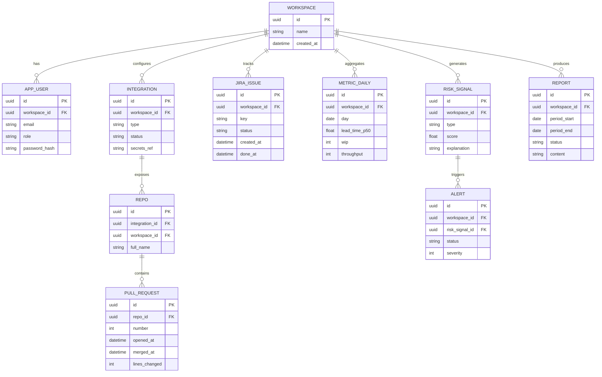

# ER Diagram — Project Pulse AI (MVP)

```mermaid
erDiagram
  WORKSPACE ||--o{ APP_USER : has
  WORKSPACE ||--o{ INTEGRATION : configures
  INTEGRATION ||--o{ REPO : exposes
  REPO ||--o{ PULL_REQUEST : contains
  WORKSPACE ||--o{ JIRA_ISSUE : tracks
  WORKSPACE ||--o{ METRIC_DAILY : aggregates
  WORKSPACE ||--o{ RISK_SIGNAL : generates
  RISK_SIGNAL ||--o{ ALERT : triggers
  WORKSPACE ||--o{ REPORT : produces

  WORKSPACE {
    uuid id PK
    string name
    datetime created_at
  }

  APP_USER {
    uuid id PK
    uuid workspace_id FK
    string email
    string role
    string password_hash
  }

  INTEGRATION {
    uuid id PK
    uuid workspace_id FK
    string type
    string status
    string secrets_ref
  }

  REPO {
    uuid id PK
    uuid integration_id FK
    uuid workspace_id FK
    string full_name
  }

  PULL_REQUEST {
    uuid id PK
    uuid repo_id FK
    int number
    datetime opened_at
    datetime merged_at
    int lines_changed
  }

  JIRA_ISSUE {
    uuid id PK
    uuid workspace_id FK
    string key
    string status
    datetime created_at
    datetime done_at
  }

  METRIC_DAILY {
    uuid id PK
    uuid workspace_id FK
    date day
    float lead_time_p50
    int wip
    int throughput
  }

  RISK_SIGNAL {
    uuid id PK
    uuid workspace_id FK
    string type
    float score
    string explanation
  }

  ALERT {
    uuid id PK
    uuid workspace_id FK
    uuid risk_signal_id FK
    string status
    int severity
  }

  REPORT {
    uuid id PK
    uuid workspace_id FK
    date period_start
    date period_end
    string status
    string content
  }
```